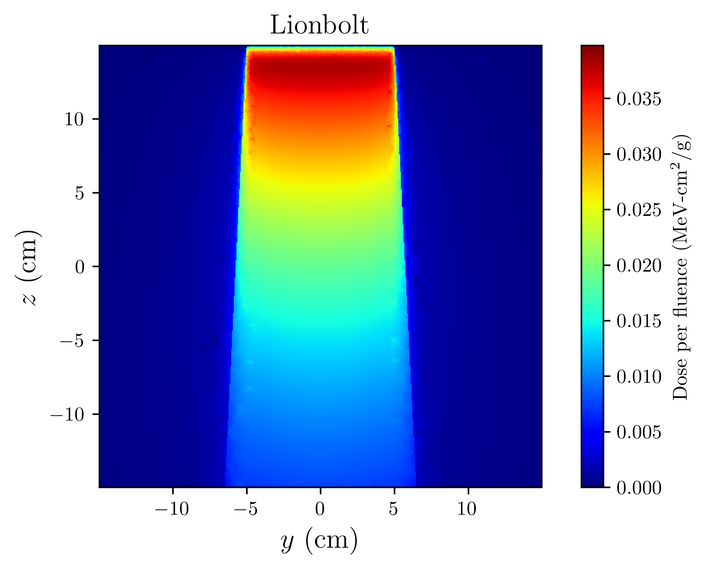
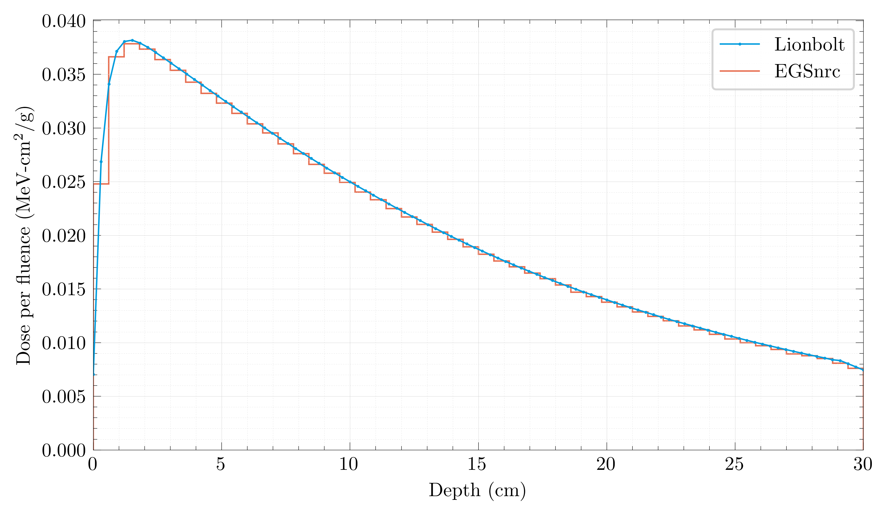
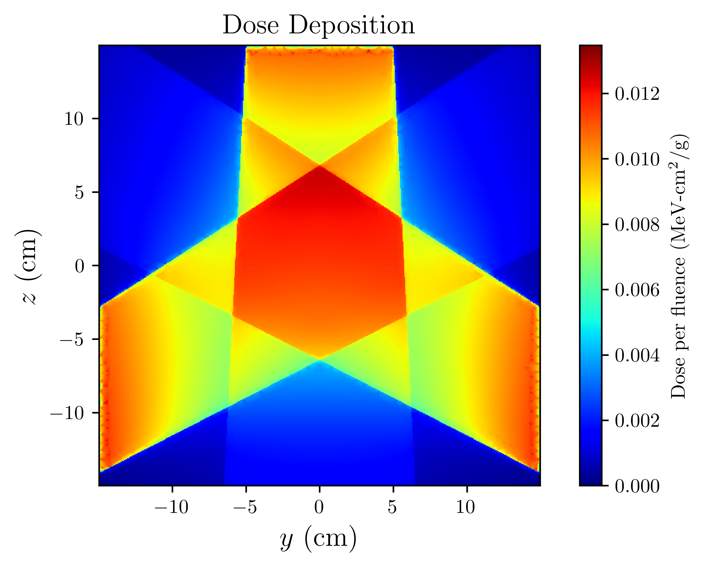
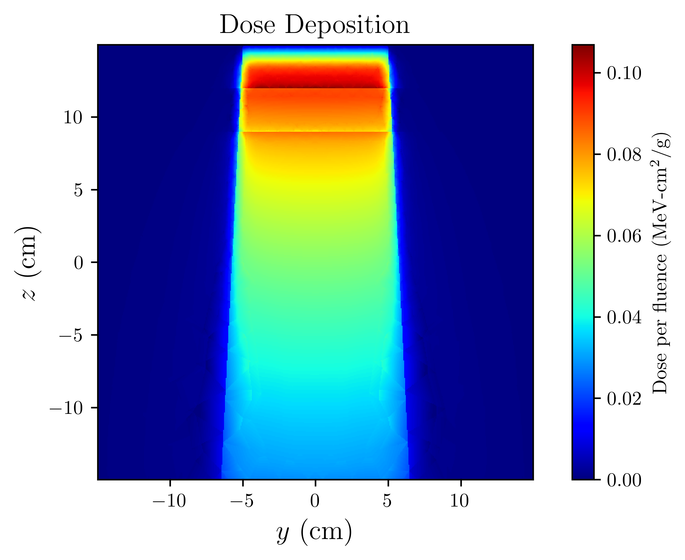
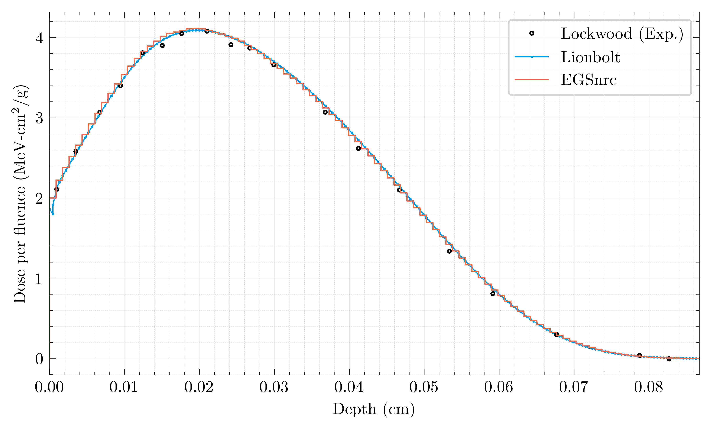

 

Developed by Muhsin H. Younis (myounis@psu.edu / myounis@umd.edu)
=================================================================

---------------------------------------------------------------------------------------
VERSION: 1.0.0 (Released 8-17-26)                                                      
   Licensed under the GNU General Public License 3.0.                                  
   See LICENSE/gpl-3.0.txt or visit https://www.gnu.org/licenses/ for more information.
---------------------------------------------------------------------------------------

Lionbolt is a deterministic, finite-element Boltzmann transport code that is usable as either a program running from an input file or a library with an API designed for user-friendliness.

Part of the [Open Radiation Physics Suite (OpenRPS)](https://mhyounis.github.io/OpenRPS/).

Contact me at myounis@psu.edu. I am always interested in discussing Lionbolt.

REQUIREMENTS
------------

The requirements of this program are all given by the `environment.yaml` file, which can also be used to automatically create a conda environment named 'lblt.' This can be done using:

  `conda env create -f environment.yaml`

If you prefer to set up your environment a different way, you can just as easily read the `environment.yaml` as a requirements list.

BUILDING AND RUNNING
--------------------

It is highly recommended that you follow [the Lionbolt Quickstart guide](https://mhyounis.github.io/OpenRPS/Lionbolt/quickstart.html) on the OpenRPS website. A summary will be provided below.

Lionbolt comes with a submit script which can also compile and remove Lionbolt build files. In order to build Lionbolt with this submit script, use:
  
  `Lionbolt.py -b`

(If you want to remove all build files use):

  `Lionbolt.py -c`
  
In order to submit a Lionbolt input file, use:

  `Lionbolt.py your_input_file.in`

If on the first run you attempt to provide your input file without building, Lionbolt will build anyway. To submit a Lionbolt driver file, use:

  `Lionbolt.py your_driver_file.f90`

and Lionbolt will always need to rebuild for this. To control the number of threads to use for OpenMP, use the flag `-n`:

  `Lionbolt.py your_input_file.in -n`

USER INPUT
----------

A detailed documentation of user input can be found in [the Lionbolt User Input page](https://mhyounis.github.io/OpenRPS/Lionbolt/input.html).

However, some example input files and validation cases are located in `examples/` and `validation/` respectively. The full .h5 outputs are not given due to their large size, but the user is encouraged to re-run them to see that they have installed Lionbolt properly, or to work with the outputs to get an understanding of how Lionbolt formats its results. Corresponding mesh files are included as needed, in addition to .geo files that would allow the user to recreate the meshes with tweaked parameters or get an understanding of how to create Lionbolt-compatible meshes. Note that if you tweak parameters in the mesh geometry, you may want to make adjustments to the input file as well, as Lionbolt defines beams in the reference frame of the mesh, in addition to basic mesh operations such as translation and scaling which of the provided input files rely on.

RECOMMENDED
-----------
  
  __Terpdose__ 

    A [python package](https://github.com/mhyounis/Terpdose), also part of the OpenRPS, created to facilitate reading of Lionbolt output, some post-processing quantities, and plotting.
    Not at all mandatory, and Lionbolt already handles certain post-processing quantities (such as total fluence, dose, etc.) for speed.
  

REFERENCES
----------

Lionbolt relies on some of the solvers available in the open-source SPARSKIT package. While Lionbolt primarily contains wrappers to the relevant subroutines, the subroutines themselves are indeed packaged with Lionbolt and located in third_party/SPARSKIT/iters.f, which we thus stress is part of SPARSKIT and not Lionbolt. The citation for SPARSKIT is given in the folder but restated here:

Yousef Saad and Martin H. Schultz. GMRES: a generalized minimal residual algorithm for solving nonsymmetric linear systems. *SIAM Journal on Scientific and Statistical Computing*, 7(3):856–869, July 1986. doi:10.1137/0907058.

VALIDATION
----------

See `validation/` for a series of validation solves, where the EGSnrc Monte Carlo program with the 521ICRU physics library was used as a benchmark. Note that until NittanyPhysics offers radiative scattering and atomic relaxation, some of the high-Z, high-energy results will have disagreements with the EGSnrc solves. These mechanisms are currently implemented but were not successfully validated.

FEATURED IMAGES
---------------

---------------------------------------------------------

  

**6 MV polychromatic X-ray beam incident on typical water tank phantom**

---------------------------------------------------------
---------------------------------------------------------

 

**Three 1 MeV X-ray beams incident on a water tank**

---------------------------------------------------------
---------------------------------------------------------

 

**6 MeV X-ray beam incident on a water tank that contains a slab of aluminum**

---------------------------------------------------------
---------------------------------------------------------

**Physics validation case - 521 keV electrons incident on infinite slab of Aluminum, as compared to experiment (Lockwood calorimetry) and EGSnrc Monte Carlo program.**

---------------------------------------------------------